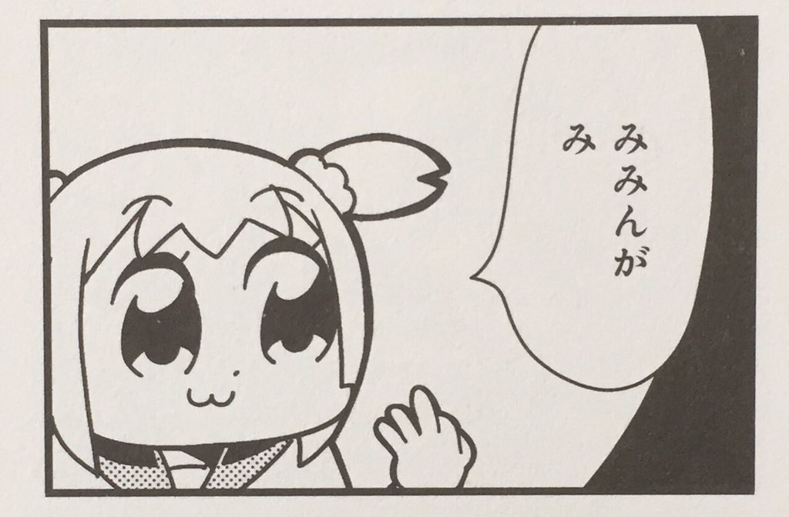

# twitter-bot-mimin
渋澤タカシ[@niltea](https://twitter.com/niltea) がGithubにpushした時に下記の **みみんがみ** の画像をTwitterに投稿します。




## SETUP ENVIRONMENT VARIABLES
Set these value to `EC2 Parameter Store`.

 * `/mimin/consumer_key`: Twitter's consumer key
 * `/mimin/consumer_secret`: Twitter's consumer secret
 * `/mimin/access_token_key`: Twitter's access token
 * `/mimin/access_token_secret`: Twitter's access secret


## SETUP SERVERLESS SCRIPT
```
git clone https://github.com/celeron1ghz/twitter-bot-mimin.git
cd twitter-bot-mimin
sls deploy
```


## SETUP Github Webhook
Set **API Gateway**'s URL to **Github Webhook URL**.

`Content-Type` should be `application/json`.


## SEE ALSO
 * https://github.com/celeron1ghz/twitter-bot-mimin.git
 * https://twitter.com/niltea
 * https://twitter.com/mimin_ga_mi_bot
